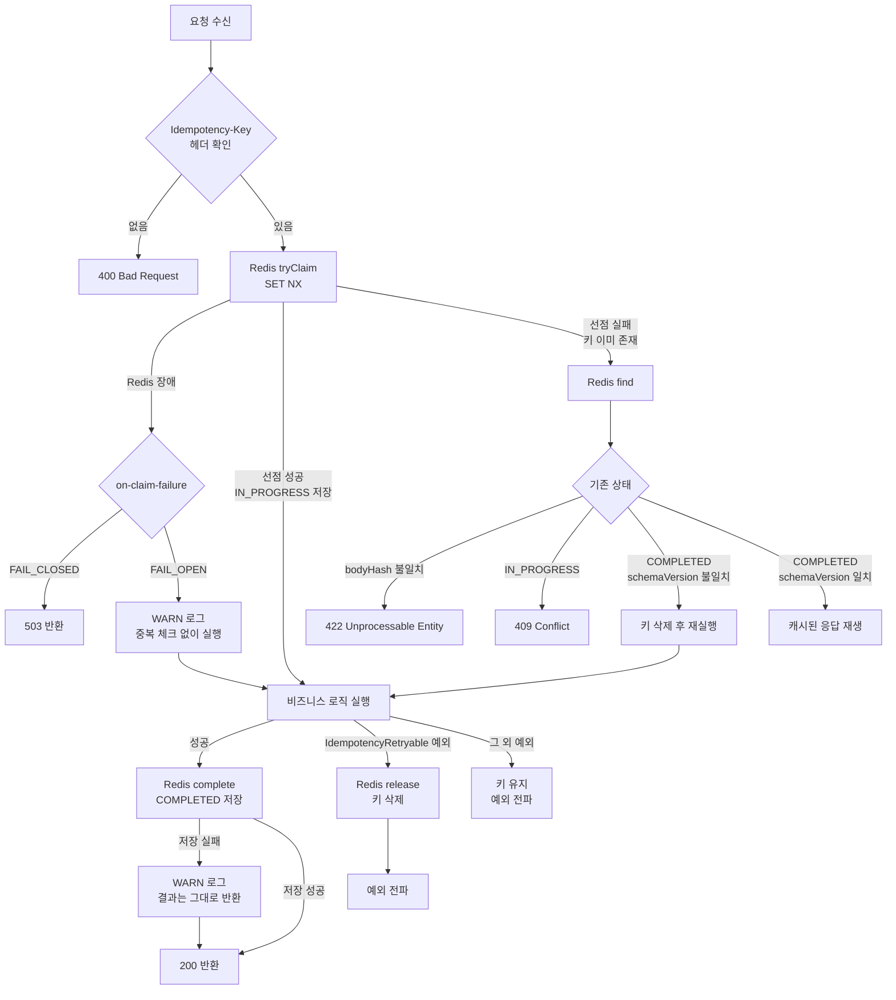
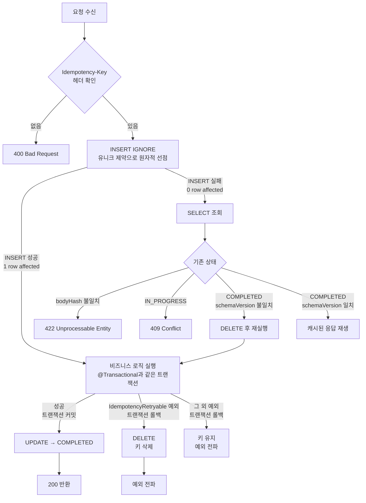

# idempotent-spring-boot-starter

HTTP 멱등성 처리 Spring Boot Starter 라이브러리입니다. Redis(기본) 또는 JDBC(DB) 저장소를 선택할 수 있습니다.

## 설치

```gradle
repositories {
    maven { url 'https://jitpack.io' }
}

dependencies {
    implementation 'com.github.sejinheo:idempotent-spring-boot-starter:v0.3.0'
}
```

## 저장소 선택

### Redis (기본)

분산 환경에 적합합니다. 별도 설정 없이 Redis 의존성만 있으면 자동으로 활성화됩니다.

```yaml
idempotency:
  storage: redis  # 기본값, 생략 가능

spring:
  data:
    redis:
      host: localhost
      port: 6379
```

### JDBC (DB)

결제처럼 절대 중복 실행이 안 되는 경우에 권장합니다. 비즈니스 트랜잭션과 같은 DB 트랜잭션으로 묶여 강한 멱등성을 보장합니다. 별도 DB를 두는 게 아니라 사용 중인 DB에 테이블 하나가 추가됩니다.

```yaml
idempotency:
  storage: jdbc
```

사용 전 `schema-mysql.sql` 또는 `schema-postgresql.sql`로 테이블을 생성해야 합니다.

```sql
-- schema-mysql.sql
CREATE TABLE IF NOT EXISTS idempotency_keys (
    idempotency_key VARCHAR(255) NOT NULL,
    status          VARCHAR(20)  NOT NULL,
    body_hash       VARCHAR(64)  NOT NULL,
    http_status     INT,
    body_json       TEXT,
    expires_at      DATETIME     NOT NULL,
    PRIMARY KEY (idempotency_key)
) ENGINE = InnoDB DEFAULT CHARSET = utf8mb4;
```

## UserIdExtractor 등록 (필수)

사용자 간 Idempotency-Key 격리를 위해 반드시 빈으로 등록해야 합니다. 없으면 서버가 기동되지 않습니다.

```java
@Bean
public UserIdExtractor userIdExtractor() {
    // 예: JWT에서 사용자 ID 추출
    return request -> jwtUtil.extractUserId(request.getHeader("Authorization"));
}
```

## 설정 (application.yml)

```yaml
idempotency:
  key-prefix: "order-service:idempotency:"  # 서비스별로 다르게 설정 (Redis 키 충돌 방지)
  ttl-hours: 24                              # COMPLETED 응답 보관 TTL (기본: 24시간)
  in-progress-ttl-seconds: 30               # 처리 중 상태 TTL (기본: 30초, API 처리 시간에 맞게 조정)
  on-claim-failure: FAIL_CLOSED             # 선점 실패 시 동작 정책 (기본: FAIL_CLOSED)
  storage: redis                             # redis(기본) 또는 jdbc
```

## 사용법

`@Idempotent`를 컨트롤러 메서드에 붙이면 됩니다. 순수 DTO 반환과 `ResponseEntity<T>` 반환 모두 지원합니다.

```java
@Idempotent
@PostMapping("/orders")
public ResponseEntity<Void> createOrder(@RequestBody CreateOrderRequest request) {
    orderService.create(request);
    return ResponseEntity.ok().build();
}
```

클라이언트는 요청마다 `Idempotency-Key` 헤더에 UUID 등 고유값을 담아 보내야 하고,
네트워크 재시도나 버튼 중복 클릭 시에도 **같은 시도에 대해서는 같은 키**를 재사용해야 합니다.

```
POST /orders
Idempotency-Key: 3f29b6b2-1c2a-4e2e-9a2e-1234567890ab
```

## 응답 규칙

| 상황 | 응답 |
|---|---|
| 헤더 없음 | 400 Bad Request |
| 같은 키로 첫 요청 | 정상 실행 |
| 같은 키 + 같은 바디 재요청 (처리 완료 후) | 캐시된 응답 그대로 재생 |
| 같은 키 + 같은 바디 재요청 (처리 중) | 409 Conflict |
| 같은 키 + 다른 바디 | 422 Unprocessable Entity |
| Redis 장애 (`FAIL_CLOSED`) | 5xx 오류 |
| Redis 장애 (`FAIL_OPEN`) | 정상 실행 (중복 실행 가능성 감수) |

## 예외 발생 시 재시도 허용

기본적으로 예외가 발생하면 키를 유지합니다. 외부 시스템 호출이 이미 성공한 상태에서 후처리가 실패한 경우 키를 삭제하면 재시도 시 이중 실행이 발생할 수 있기 때문입니다.

재시도해도 안전한 예외(잔액 부족, 입력값 검증 실패 등)는 `IdempotencyRetryable`을 구현하면 예외 발생 시 키를 삭제해서 재시도를 허용합니다.

```java
// 재시도 허용 — 외부 시스템 호출 전에 실패하므로 안전
public class InsufficientBalanceException extends RuntimeException
        implements IdempotencyRetryable { ... }

// 재시도 불허 — 결제가 이미 나갔을 수 있으므로 키 유지
public class PaymentPostProcessingException extends RuntimeException { ... }
```

## 동작 흐름

### Redis 저장소



### JDBC 저장소



> **JDBC가 더 강한 멱등성을 보장하는 이유**: 비즈니스 로직과 같은 트랜잭션으로 묶이므로
> "커밋은 됐는데 COMPLETED 기록이 없는" 공백이 구조적으로 발생하지 않는다.

## 보장하는 것 / 보장하지 않는 것

### 보장하는 것

| 상황 | 동작 |
|---|---|
| 같은 키 + 같은 바디 재요청 (처리 완료 후) | 캐시된 응답 재생, 메서드 재실행 없음 |
| 같은 키 동시 요청 | 하나만 실행, 나머지는 409 반환 |
| 같은 키 + 다른 바디 | 422로 거부 |
| 배포 후 저장 형식 변경 | schemaVersion 불일치 시 캐시 무시하고 재실행 |

### 보장하지 않는 것

| 상황 | 설명 |
|---|---|
| `on-claim-failure: FAIL_OPEN` 시 중복 실행 | Redis 장애 시 중복 체크 없이 통과, 이중 실행 가능 |
| Redis `complete` 저장 실패 후 재시도 | 결과 저장 실패 시 WARN 로그만 남고 캐시 없음, 재시도 시 재실행됨 |
| IN_PROGRESS TTL 만료 후 재시도 | TTL 내 처리 못 하면 키 소멸, 재시도 시 새 요청으로 처리됨 |
| 비-HTTP 컨텍스트 | Kafka, gRPC 등 미지원 |
| SpEL 기반 키 표현식 | 헤더 값 하나만 키로 사용 |

> **핵심**: 이 라이브러리는 "무조건 한 번"을 보장하지 않는다. Redis 저장소는 장애 시나리오에서
> 중복 실행 가능성이 있다. 절대 중복 실행이 안 되는 결제 등의 API는 JDBC 저장소를 사용하라.

## 지원 범위

- HTTP 요청 전용 (Kafka 등 비-HTTP 컨텍스트 미지원)
- 순수 DTO 반환 및 `ResponseEntity<T>` 반환 모두 지원
- 키는 헤더 값 하나만 사용 (SpEL 키 미지원)
- TTL은 전역 설정으로 고정 (COMPLETED: `ttl-hours`, IN_PROGRESS: `in-progress-ttl-seconds`)
- 동시 요청은 REJECT만 지원 (409 반환)
- 선점 실패 시 동작은 `on-claim-failure`로 선택 (`FAIL_CLOSED`: 요청 실패, `FAIL_OPEN`: 중복 감수하고 통과)

## 로컬 테스트

Docker가 실행 중이어야 합니다 (Testcontainers가 Redis 컨테이너를 띄웁니다).

```bash
./gradlew test
```
